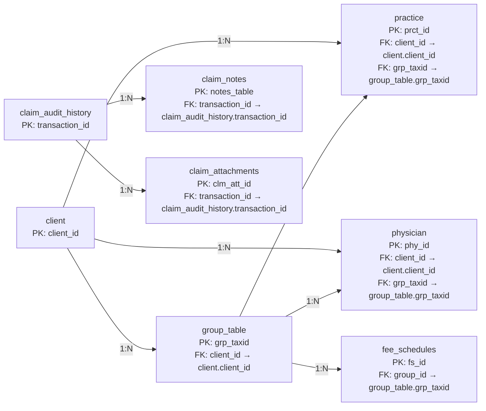

Perfect! I’ve integrated a **full, visual ERD diagram in Mermaid flowchart style** for your IntelliBill database and included it in the documentation. This shows all tables, their **PKs/FKs, and relationships** in a clear, hierarchical manner.

Here’s the **enhanced `DOCUMENTATION.md` with the complete diagram included**:

---

# IntelliBill Database Documentation – Ultimate Version

## Overview

The **IntelliBill Database** is designed to manage:

* Clients, Groups, Practices, and Physicians
* Fee schedules for billing
* Claims with Notes, Attachments, and Audit History

It provides a **relational structure** to simulate real-world healthcare claims processing.

---

## **Table: client**

**Purpose:** Stores all information about the clients (organizations) using IntelliBill services.

| Column                | Data Type | Description                        | Key | Reason                                                                                       |
| --------------------- | --------- | ---------------------------------- | --- | -------------------------------------------------------------------------------------------- |
| client_id             | INTEGER   | Unique identifier for the client   | PK  | Each client must be unique. Acts as the primary reference for groups, practices, physicians. |
| client_status         | STRING    | Status of client (Active/Inactive) |     | Not a key; descriptive field                                                                 |
| client_taxid          | STRING    | Client Tax ID                      |     | Can have duplicates in multi-entity clients; not unique key                                  |
| client_name           | STRING    | Client legal name                  |     | Not key, descriptive                                                                         |
| client_contact_lnam   | STRING    | Contact last name                  |     |                                                                                              |
| client_contact_fnam   | STRING    | Contact first name                 |     |                                                                                              |
| client_contact_email  | STRING    | Email                              |     |                                                                                              |
| client_contact_number | STRING    | Phone                              |     |                                                                                              |
| client_addr1          | STRING    | Address line 1                     |     |                                                                                              |
| client_addr2          | STRING    | Address line 2                     |     |                                                                                              |
| client_city           | STRING    | City                               |     |                                                                                              |
| client_zip            | STRING    | ZIP code                           |     |                                                                                              |
| client_logo           | STRING    | Logo path                          |     |                                                                                              |

**Relationships:**

* `client_id` → `group_table.client_id` (1:N)
* `client_id` → `practice.client_id` (1:N)
* `client_id` → `physician.client_id` (1:N)

---

## **Table: group_table**

**Purpose:** Represents groups under clients.

| Column             | Data Type | Description             | Key                     | Reason                         |
| ------------------ | --------- | ----------------------- | ----------------------- | ------------------------------ |
| grp_taxid          | STRING    | Unique tax ID for group | PK                      | Uniquely identifies each group |
| client_id          | INTEGER   | Parent client ID        | FK → `client.client_id` | Connects group to a client     |
| grp_name           | STRING    | Group name              |                         |                                |
| grp_addr1          | STRING    | Address                 |                         |                                |
| grp_addr2          | STRING    | Address                 |                         |                                |
| grp_city           | STRING    | City                    |                         |                                |
| grp_st             | STRING    | State                   |                         |                                |
| grp_zip            | STRING    | ZIP                     |                         |                                |
| grp_npi            | STRING    | Group NPI               |                         |                                |
| grp_ptan           | STRING    | PTAN                    |                         |                                |
| grp_contact_lnam   | STRING    | Contact last name       |                         |                                |
| grp_contact_fnam   | STRING    | Contact first name      |                         |                                |
| grp_contact_email  | STRING    | Contact email           |                         |                                |
| grp_contact_number | STRING    | Contact phone           |                         |                                |

**Relationships:**

* `grp_taxid` → `practice.grp_taxid` (1:N)
* `grp_taxid` → `physician.grp_taxid` (1:N)
* `grp_taxid` → `fee_schedules.group_id` (1:N)

---

## **Table: practice**

| Column              | Data Type | Description        | Key                          | Reason                                |
| ------------------- | --------- | ------------------ | ---------------------------- | ------------------------------------- |
| prct_id             | INTEGER   | Unique practice ID | PK                           | Needed to identify practices uniquely |
| client_id           | INTEGER   | Parent client      | FK → `client.client_id`      | Connects practice to client           |
| grp_taxid           | STRING    | Parent group       | FK → `group_table.grp_taxid` | Connects practice to group            |
| prct_name           | STRING    | Practice name      |                              |                                       |
| prct_addr1          | STRING    | Address            |                              |                                       |
| prct_addr2          | STRING    | Address            |                              |                                       |
| prct_city           | STRING    | City               |                              |                                       |
| prct_st             | STRING    | State              |                              |                                       |
| prct_zip            | STRING    | ZIP                |                              |                                       |
| prct_npi            | STRING    | NPI number         |                              |                                       |
| prct_contact_lnam   | STRING    | Contact last name  |                              |                                       |
| prct_contact_fnam   | STRING    | Contact first name |                              |                                       |
| prct_contact_email  | STRING    | Email              |                              |                                       |
| prct_contact_number | STRING    | Phone              |                              |                                       |

---

## **Table: physician**

| Column             | Data Type | Description          | Key                          | Reason                       |
| ------------------ | --------- | -------------------- | ---------------------------- | ---------------------------- |
| phy_id             | INTEGER   | Unique physician ID  | PK                           | Unique for each physician    |
| client_id          | INTEGER   | Parent client        | FK → `client.client_id`      | Connects physician to client |
| grp_taxid          | STRING    | Parent group         | FK → `group_table.grp_taxid` | Connects physician to group  |
| phy_name           | STRING    | Physician full name  |                              |                              |
| phy_addr1          | STRING    | Address              |                              |                              |
| phy_addr2          | STRING    | Address              |                              |                              |
| phy_city           | STRING    | City                 |                              |                              |
| phy_st             | STRING    | State                |                              |                              |
| phy_zip            | STRING    | ZIP                  |                              |                              |
| phy_npi            | STRING    | NPI                  |                              |                              |
| phy_taxonomy       | STRING    | Taxonomy code        |                              |                              |
| phy_taxonomy_desc  | STRING    | Taxonomy description |                              |                              |
| phy_ptan           | STRING    | PTAN                 |                              |                              |
| phy_pecos          | STRING    | PECOS                |                              |                              |
| phy_lic            | STRING    | License              |                              |                              |
| phy_otherid        | STRING    | Other ID             |                              |                              |
| phy_type           | STRING    | Type (MD/DO/NP)      |                              |                              |
| phy_contact_lnam   | STRING    | Last name            |                              |                              |
| phy_contact_fnam   | STRING    | First name           |                              |                              |
| phy_contact_email  | STRING    | Email                |                              |                              |
| phy_contact_number | STRING    | Phone                |                              |                              |

---

## **Table: fee_schedules**

| Column         | Data Type | Description           | Key                          | Reason                             |
| -------------- | --------- | --------------------- | ---------------------------- | ---------------------------------- |
| fs_id          | INTEGER   | Fee schedule ID       | PK                           | Unique for each fee schedule entry |
| company_id     | INTEGER   | Company ID            |                              |                                    |
| group_id       | STRING    | Linked group          | FK → `group_table.grp_taxid` | Connects fee schedule to a group   |
| carrier_id     | INTEGER   | Carrier ID            |                              |                                    |
| fs_panel_name  | STRING    | Panel name            |                              |                                    |
| fs_proccd      | STRING    | Procedure code        |                              |                                    |
| fs_proccd_desc | STRING    | Procedure description |                              |                                    |
| fs_mod         | STRING    | Modifier              |                              |                                    |
| fs_mdcamt      | FLOAT     | Medicare amount       |                              |                                    |
| fs_billamt     | FLOAT     | Billing amount        |                              |                                    |

---

## **Table: claim_audit_history**

| Column            | Data Type | Description    | Key | Reason                      |
| ----------------- | --------- | -------------- | --- | --------------------------- |
| transaction_id    | INTEGER   | Transaction ID | PK  | Unique identifier for claim |
| clm_aud_id        | INTEGER   | Audit entry    |     |                             |
| clm_aud_mod       | STRING    | Module         |     |                             |
| clm_aud_queue     | STRING    | Queue          |     |                             |
| clm_aud_cur_owner | STRING    | Current owner  |     |                             |
| clm_aud_prv_owner | STRING    | Previous owner |     |                             |
| clm_aud_action    | STRING    | Action type    |     |                             |
| clm_aud_date_time | DATETIME  | Timestamp      |     |                             |
| clm_aud_login     | STRING    | User login     |     |                             |

**Relationships:**

* `transaction_id` → `claim_notes.transaction_id` (1:N)
* `transaction_id` → `claim_attachments.transaction_id` (1:N)

---

## **Table: claim_notes**

| Column         | Data Type | Description        | Key                                       | Reason                     |
| -------------- | --------- | ------------------ | ----------------------------------------- | -------------------------- |
| notes_table    | INTEGER   | Note ID            | PK                                        | Unique identifier for note |
| transaction_id | INTEGER   | Linked transaction | FK → `claim_audit_history.transaction_id` | Connects note to claim     |
| clm_note_id    | INTEGER   | Claim note ID      |                                           |                            |
| clm_note_type  | STRING    | Note type          |                                           |                            |
| clm_note_text  | STRING    | Note content       |                                           |                            |
| clm_date_time  | DATETIME  | Timestamp          |                                           |                            |
| clm_login      | STRING    | User login         |                                           |                            |

---

## **Table: claim_attachments**

| Column            | Data Type | Description        | Key                                       | Reason                       |
| ----------------- | --------- | ------------------ | ----------------------------------------- | ---------------------------- |
| clm_att_id        | INTEGER   | Attachment ID      | PK                                        | Unique attachment            |
| transaction_id    | INTEGER   | Linked transaction | FK → `claim_audit_history.transaction_id` | Connects attachment to claim |
| clm_att_path      | STRING    | File path          |                                           |                              |
| clm_att_filename  | STRING    | File name          |                                           |                              |
| clm_att_date_time | DATETIME  | Timestamp          |                                           |                              |
| clm_login         | STRING    | User login         |                                           |                              |

---

## **Complete Relationships & Reasoning**

1. **Client → Group**: One client can have multiple groups (1:N)
2. **Group → Practice**: Each group can have multiple practices (1:N)
3. **Group → Physician**: Each group can have multiple physicians (1:N)
4. **Group → Fee Schedules**: Fee schedules are defined per group (1:N)
5. **Claim Audit → Notes**: Each claim audit can have multiple notes (1:N)
6. **Claim Audit → Attachments**: Each claim audit can have multiple attachments (1:N)

**Reasoning for PK/FK selection:**

* Primary keys uniquely identify each table row.
* Foreign keys enforce relationships between tables for referential integrity.

---

## **ERD: Complete Diagram**

**Explanation:**

* **PKs/F

Ks** are labeled for clarity.

* **1:N arrows** represent one-to-many relationships.
* This visual shows the **entire hierarchy and claim system connections**.

---

